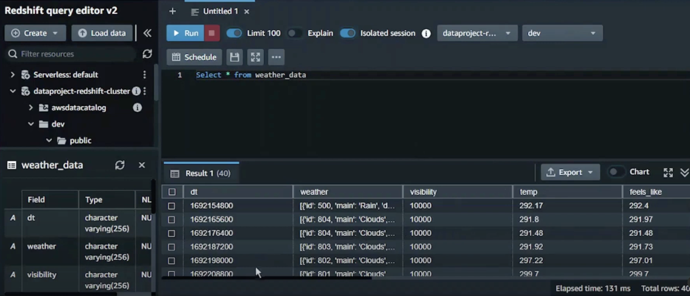

# Weather Data Pipeline Using AWS Services
## Overview
This project fetches weather data from the OpenWeather API and processes it through an ETL pipeline designed using AWS services.\
The goal is to store the data in an AWS Redshift database for analysis, leveraging a scalable and automated cloud-based architecture.

## Architecture

The high-level architecture consists of:

**Data Source:** Weather data retrieved from the OpenWeather API.\
**Data Processing:** ETL pipeline implemented using AWS Glue for transformation.\
**Data Storage:** Data is stored temporarily in Amazon S3 before being loaded into Amazon Redshift.\
**Orchestration:** Workflow is scheduled and managed with Apache Airflow.

## Features
Automated ETL pipeline for weather data ingestion and processing.\
Scalable cloud-based storage and database solution using AWS.\
Efficient orchestration and task scheduling with Apache Airflow.

## Technologies Used
**AWS Services**: S3, Glue, Redshift\
**Apache Airflow**: For workflow orchestration\
**OpenWeather API**: Data source\
**Python**: Programming language for scripting and API integration

## CloudFormation Setup
To create the batch environment for this project, I used an existing YAML template from Anand Dedha. This template provided a foundational configuration, including an S3 bucket, IAM roles, AWS Glue connections and Redshift clusters.\
Leveraging this template allowed me to focus on understanding and implementing the ETL pipeline, as well as exploring *AWS CloudFormation* as a tool for infrastructure as code.

## Results
The processed weather data is stored in *Redshift* and can be queried for analysis. This pipeline demonstrates automation and scalability, key aspects of modern data engineering.

## Challenges
The openweather_api DAG was not created while configuring Airflow. I edited the workflow and added the requirements.txt to the workflow manually from the S3 bucket, then redeployed the workflow. However, the DAG was still not created. I solved this by removing the version numbers from requirements.txt. 

## Lessons Learned
Working with cloud-based services like *AWS Glue* and *Redshift* to design scalable data workflows.\
Orchestrating tasks efficiently using *Apache Airflow*.\
Handling API integrations and managing structured data pipelines.

## Future Improvements
While the current scope is focused on batch processing, future iterations could explore real-time data ingestion using *AWS Kinesis*.\
Database could be used for developing applications or data visualisations.